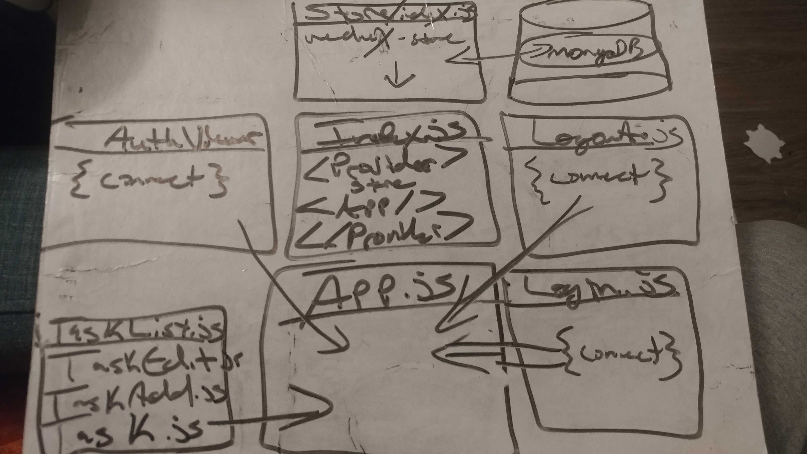

# LAB - 28/29 ToDo Application

## Author: James Dunn

### Links and Resources

- [Sandbox URL](https://codesandbox.io/embed/thirsty-chatterjee-ws9vm?fontsize=14&hidenavigation=1&theme=dark)

- [Netlify Site](https://csb-ws9vm.netlify.com/)

### Instructions

#### In order to run this app, simply login with the username, "sarah@email.com" and the password of "sarahpassword" and you can begin adding, viewing, editing, and deleting tasks

### UML

